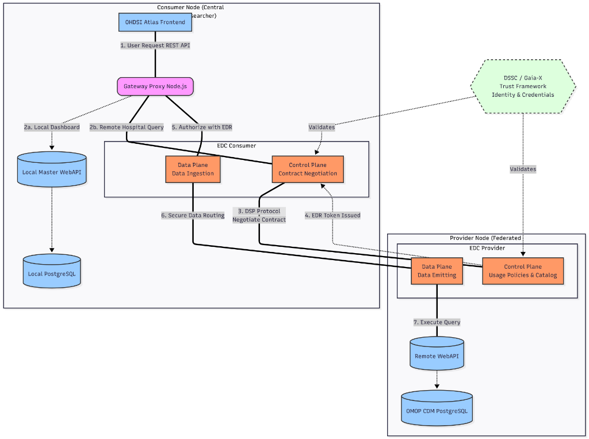

# Atlas-EDC Federation Gateway Proxy

This repository provides a transparent Node.js Gateway Proxy built using `express` and `http-proxy-middleware`. It demonstrates how the **OHDSI Atlas** monolithic web application can be bridged securely with **Eclipse Dataspace Components (EDC)** to participate in European-style Health Data Spaces (aligned with Gaia-X and DSSC blueprints).

This gateway achieves federated, multi-centric clinical research data visualization while preserving **Data Sovereignty** at the source hospital node, without modifying the core OHDSI legacy source code.

## Architecture & Data Space Alignment



This reverse proxy acts as an intelligent intermediary between the standalone Atlas frontend and the central WebAPI backend. It effectively marries the semantic interoperability of the OMOP Common Data Model with the technical trust framework of an EDC network:

1. **Source Interception (Federated Catalog):** Intercepts initialization calls to seamlessly inject virtual "Federated Nodes" into the Atlas "Data Sources" list. In a real Data Space, these nodes represent discovered Data Assets from a Federated Catalog.
2. **Dynamic EDC Routing (Contract Negotiation):** Whenever a user queries aggregated data from a remote hospital (e.g., visualizing a demographic dashboard), the gateway transparently automates the EDC Contract Negotiation based on agreed Usage Policies. It retrieves an Endpoint Data Reference (EDR) token and performs a secure End-to-End data pull via the EDC Data Plane, never exposing the backend API directly to the public internet.
3. **Federated Phenotype Library (Semantic Alignment):** Automatically builds a shared analytic library by merging local PostgreSQL cohorts with real-time remote JSON definitions fetched via EDC. It employs algorithmic namespacing to avoid ID collisions, enabling researchers to share standardized clinical rules across the network instantly.
4. **Transparent Passthrough (Local Execution):** Requests destined for local execution bypass the EDC engine and go directly to the standard Apache Tomcat/WebAPI instance, ensuring existing local workflows remain unaffected.

## Requirements

- Node.js >= 18.x
- Local/Standard OHDSI WebAPI Instance
- Running Eclipse EDC Connectors (Provider & Consumer) for testing the remote routing layer.

## Setup & Running

1. Install dependencies:

   ```bash
   npm install
   ```

2. (Optional) Copy `.env.example` to `.env` and set your specific port and WebAPI URL if different from the defaults:

   ```bash
   cp .env.example .env
   ```

3. Run the proxy (it defaults to `http://localhost:8080` for the WebAPI if no `.env` is declared):

   ```bash
   node server.js
   ```

4. In OHDSI Atlas, change your internal WebAPI endpoint setting to point to `http://localhost:3000/WebAPI/`.

## Legal & Architectural Limitations (Secondary Use)

- **Federated Dashboards vs Advanced Studies:** This gateway excels at read-only, aggregated data pulls (Secondary Use of Health Data), vocabulary searching, and demographic dashboards.
- **Privacy-Enhancing Technologies (PETs):** While retrieving aggregated counts and JSON definitions across EDC respects data minimization principles, executing deep computational packages (like Patient-Level Prediction or Population-Level Estimation) through a synchronous REST-to-EDC tunnel is technically constrained by Atlas's monolithic design and poses GDPR risks if raw dataset linkage were to be attempted.
- **Hub & Spoke Orchestration:** For complex analytical studies, this repository demonstrates why an asynchronous Study Hub Orchestrator (bringing the computation to the data via R/SQL packages) is the required next architectural step. Forcing computational ML pipelines strictly through a live, synchronous API gateway breaks Statistical Disclosure Control (SDC) guidelines; instead, packages must be routed securely through EDC to localized computing environments within the trusted zones of each hospital.

## Author & License

This project was developed by **Antonio Martin Garre** as an architectural proof and is released as Open Source.

Licensed under the **MIT License**. See the [LICENSE](LICENSE) file for more details.
