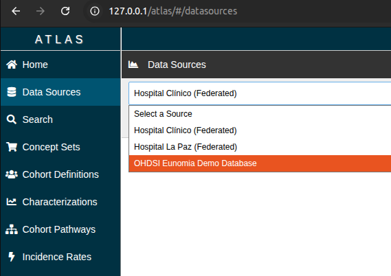
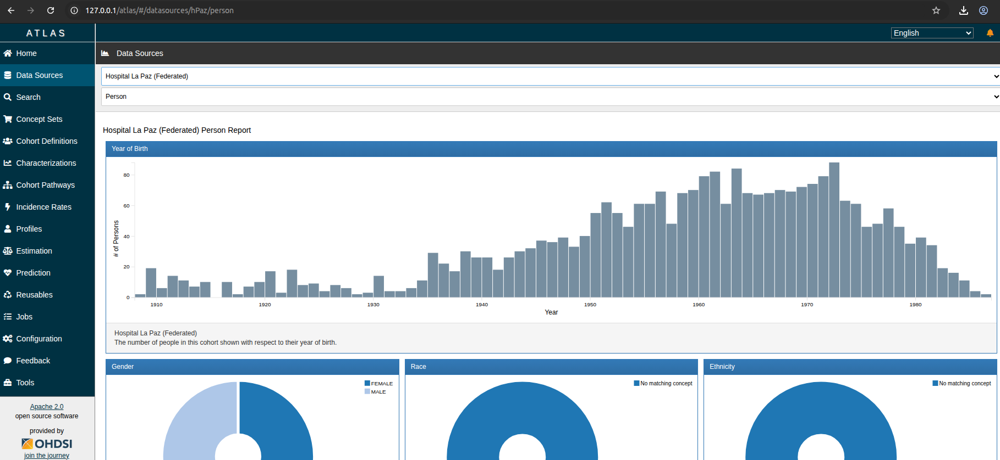
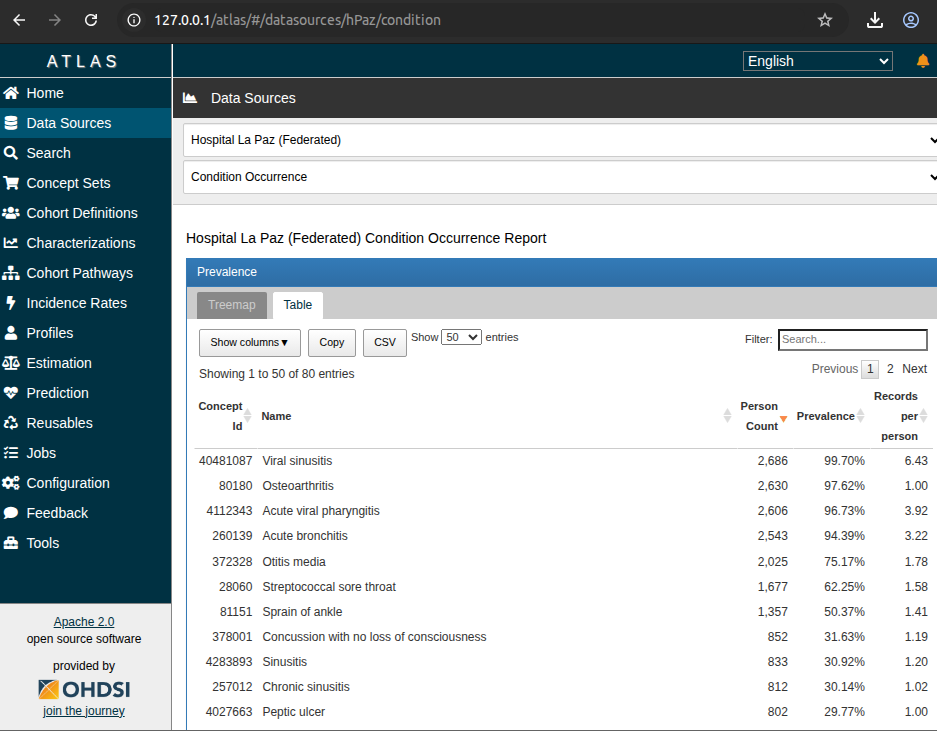

# Atlas-EDC Federation Gateway Proxy

A transparent **Node.js proxy** that bridges [OHDSI Atlas](https://github.com/OHDSI/Atlas) with [Eclipse Dataspace Components (EDC)](https://github.com/eclipse-edc/Connector) to enable **federated, multi-centric clinical research visualization** while preserving **Data Sovereignty** — without modifying the core OHDSI source code.

> Built for European Health Data Spaces (EHDS), aligned with [Gaia-X](https://gaia-x.eu/) Trust Framework and [DSSC](https://dssc.eu/) blueprints.

## What It Does

This proxy sits between Atlas and WebAPI, transparently injecting federated hospital nodes and routing data requests through the EDC Dataspace Protocol. Researchers see a unified view of multiple hospitals in Atlas, while each hospital maintains full control over its data through EDC contract negotiation and usage policies.


### Live Demo: Federated Dashboards via EDC

The proxy injects federated nodes into Atlas. Selecting a remote hospital triggers automatic EDC contract negotiation and data retrieval through the Data Plane:



Real OMOP clinical data from a federated node, delivered through the full EDC pipeline (Catalog → Contract Negotiation → Transfer → EDR Token → Data Plane Pull):





## How It Works

| Module                          | Description                                                                                                     |
| ------------------------------- | --------------------------------------------------------------------------------------------------------------- |
| **Source Interception**         | Injects virtual federated nodes into Atlas Data Sources (simulating a Federated Catalog)                        |
| **EDC Dynamic Routing**         | Intercepts requests to remote nodes → automated contract negotiation → EDR token → data pull via EDC Data Plane |
| **Federated Phenotype Library** | Merges local and remote cohort definitions with algorithmic namespacing to avoid ID collisions                  |
| **Transparent Passthrough**     | Local requests bypass EDC and go directly to WebAPI                                                             |

### EDC Dataspace Protocol Flow

```
Atlas → Proxy → EDC Consumer Management API
                    ├── 1. Catalog Request (discover provider assets)
                    ├── 2. Contract Negotiation (ODRL policy agreement)
                    ├── 3. Transfer Process (HttpData-PULL)
                    ├── 4. EDR Token (JWT signed by provider DID)
                    └── 5. Data Pull via Provider Data Plane
                              └── OHDSI WebAPI (at the provider hospital)
```

## Quick Start

### Prerequisites

- Node.js >= 18.x
- A running OHDSI WebAPI instance (e.g., [Broadsea](https://github.com/OHDSI/Broadsea))
- Eclipse EDC connectors (for federated data — see [EDC Network Setup](#edc-network-setup))

### Run the Proxy

```bash
npm install
cp .env.example .env   # Edit with your WebAPI URL and EDC endpoints
npm start
```

Then configure Atlas to use `http://localhost:3000/WebAPI/` as its Services URL.

### Docker

```bash
docker build -t atlas-edc-proxy .
docker run -p 3000:3000 \
  -e LOCAL_WEBAPI_URL=http://host.docker.internal:8080 \
  atlas-edc-proxy
```

## Configuration

All settings are configurable via environment variables (see [`.env.example`](.env.example)):

| Variable                       | Default                                               | Description                                           |
| ------------------------------ | ----------------------------------------------------- | ----------------------------------------------------- |
| `PORT`                         | `3000`                                                | Proxy listening port                                  |
| `LOCAL_WEBAPI_URL`             | `http://localhost:8080`                               | Local OHDSI WebAPI                                    |
| `EDC_CONSUMER_MANAGEMENT_URL`  | `http://127.0.0.1:8081/consumer/cp/api/management/v3` | EDC Consumer management API                           |
| `EDC_PROVIDER_PROTOCOL_URL`    | `http://provider-qna-controlplane:8082/api/dsp`       | EDC Provider DSP protocol endpoint                    |
| `EDC_PROVIDER_ID`              | `did:web:provider-identityhub%3A7083:provider`        | Provider DID identity                                 |
| `EDC_API_KEY`                  | `password`                                            | Management API authentication key                     |
| `EDC_ASSET_ID`                 | `ohdsi-webapi-v3`                                     | Asset ID registered on the provider                   |
| `EDC_PUBLIC_ENDPOINT_OVERRIDE` | _(empty)_                                             | Override data plane endpoint when running outside K8s |

## EDC Network Setup

To test the full federated data flow, you need running Eclipse EDC connectors. This repository supports two approaches:

### Option A: Eclipse EDC MVD (Recommended)

Deploy the full [Minimum Viable Dataspace](https://github.com/eclipse-edc/MinimumViableDataspace) with DID-based identity:

```bash
cd edc-network/mvd
bash deploy-inside-kind.sh    # Deploys 16 pods via Terraform
bash seed-k8s.sh              # Seeds identities and credentials
```

Then register the OHDSI WebAPI as a Data Asset on the provider connector:

```bash
cd edc-network
./register-ohdsi.sh
```

### Option B: Standalone EDC Connectors

Use the included configuration files in `edc-network/`:

- `create-ohdsi-asset.json` — Registers your OHDSI WebAPI as an EDC Data Asset
- `create-ohdsi-policy.json` — Defines the Usage Policy
- `create-ohdsi-contract.json` — Creates the Contract Definition
- `register-ohdsi.sh` — Seeds all three into a running Provider connector

## Limitations

- **Read-only dashboards**: This gateway excels at aggregated data visualization (Secondary Use). For computational studies (PLP, PLE), an asynchronous Study Hub bringing computation to data is required.
- **Privacy**: While aggregated counts respect data minimization, raw dataset linkage through a synchronous REST gateway poses GDPR risks. Complex analytics should use federated computation with Statistical Disclosure Control.
- **Monolithic Atlas**: Atlas's architecture assumes direct database access. This proxy works around that limitation via EDC-mediated REST proxying, but is inherently constrained by Atlas's synchronous request model.

## Author & License

Developed by **Antonio Martin Garre** — released as Open Source under the **MIT License**.

See [LICENSE](LICENSE) for details.

## Contributing

Contributions are welcome! See [CONTRIBUTING.md](CONTRIBUTING.md) for guidelines.
